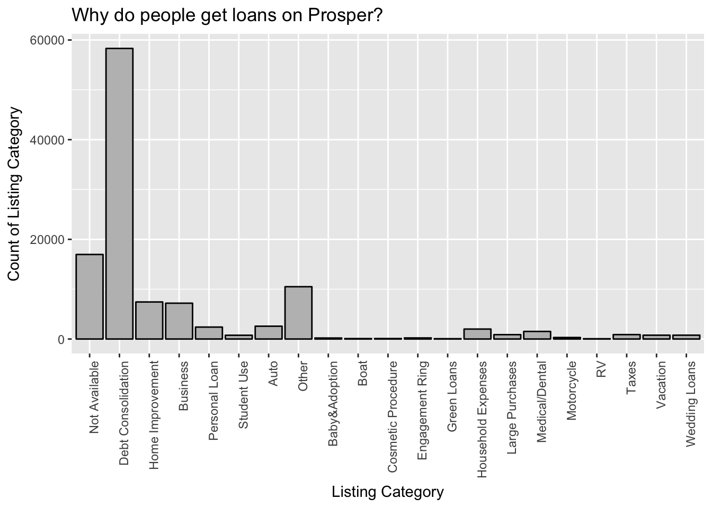
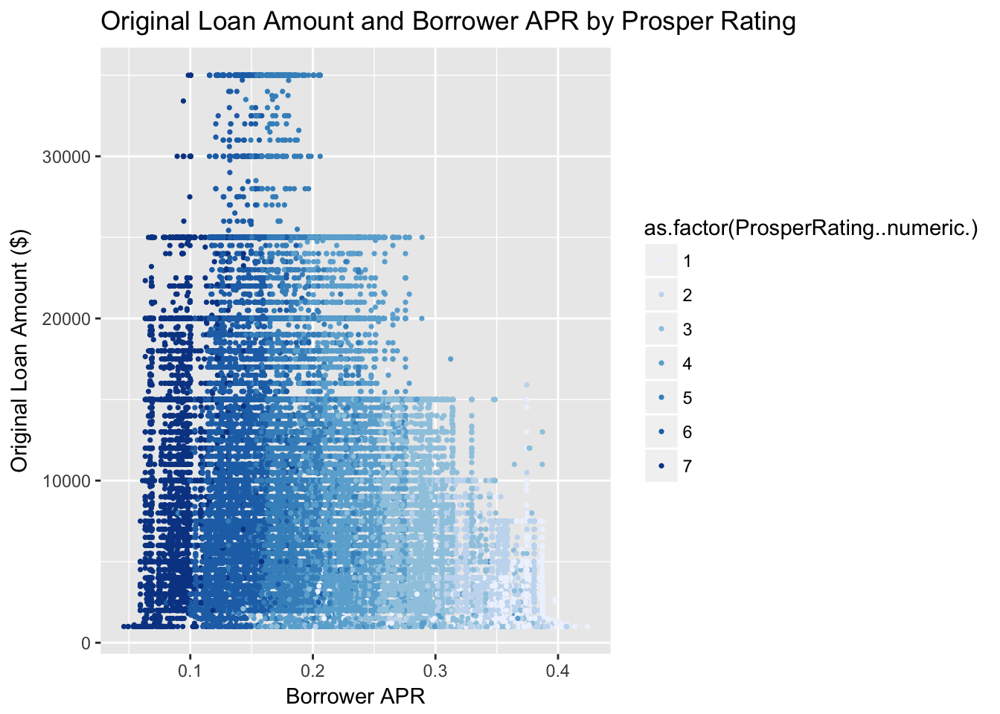
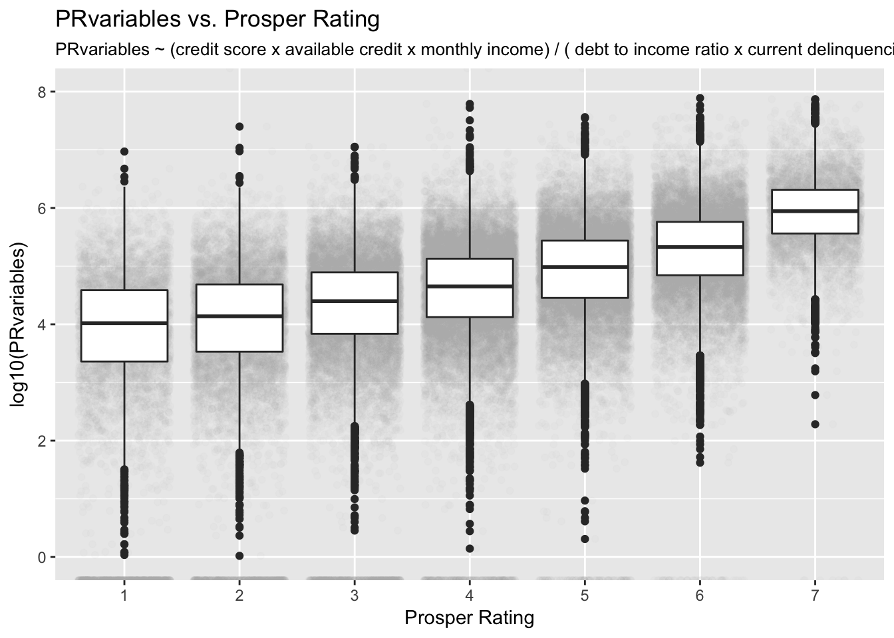

# dand-p5-exploratory-data-analysis
Exploratory Data Analysis project using R from Udacity's Data Analyst Nanodegree.

<h4>Summary</h4>

The Prosper dataset contained information about 113,937 loans with 81 variables each. The data included information about the loan (amount, status, interest, term, category, rating), the borrowers (socioeconomic data), and the lenders (number of lenders, yield). Given the vast number of variables, I decided to focus on aspect of the data to get more meaningful insights. I chose to look at how a borrowers socioeconomic status impacts the type of loan they receive. In particular I focused on the original value of the loan and the borrower APR (annual percentage rate) for the terms of the loan. I picked the APR as a metric as it’s representative of the total costs that the borrower has to bear.

Initially I explored the loan data and socioeconomic data independantly. This led to insights about what people use Prosper loans for, and typically how much they borrow, and at what rate. I then started to compare these variables against each other to unearth any relationships between them. Through performing bivariate analyses I learnt that the value of the loan and the APR are influenced by the Prosper rating, the credit score, and the income range. Digging deeper an combining these variables and more using multivariate analysis I was able to discover that the Prosper rating was the main factor that influenced the APR borrowers received. Its a number that’s generated by Prosper that determined the “loan-worthiness” of a borrower.

My next step was to figure out what factors influence the opaque Prosper rating. Given the plethora of variables to choose from, this step took time as I made chart after chart, trying to find variables that related to the Prosper rating in any way. Once I had narrowed down the variables that impacted the Prosper rating, I was curious to see if I could combine them in a way that would eventually result in a linear relationship between these combined variables and the Prosper rating. This resulted in an iterative process of testing variables, graphing them, and checking their correlation to the Prosper rating as a measure of which equations were ultimately better than the others. Eventually I settled on 5 variables that impacted the Prosper rating the most. These were the credit score, available credit, monthly income, debt to income ratio, current delinquencies.

Though it was fulfiling to identify some of the factors that contribute to the Prosper rating, I realise that there are several more factors in different combinations that impact the Prosper rating. My conclusions are limited by the data available. An interesting extension of this work would be to compare the Prosper rating with the actual result of the loan. Given more recent data (from 2014 to 2017) we would have more paid/defaulted loans and be able to close the loop and see how well the Prosper ratings were able to predict the actual riskiness of the loan.

<h4>Final Plots</h4>

The first plot depicts the reasons that people get loans with Prosper. As we can see, people are overwhelmingly using Prosper for debt reconsolidation. Knowing that most people have the same objective sets the context for what people expect when they get a loan from Prosper. I expect that Prosper offers better interest rates for these individuals than their current financing options do.

The second plot looks at two important factors that define a loan - how much you borrowed, and the annual interest you have to pay on the loan. It then compares these factors against the Prosper Rating, which uses a proprietary algorithm to determine a borrowers “loan-worthiness”. Higher ratings are better than lower ratings. I really like this visualisation because you can clearly see the distinctive Prosper ratings based on the Borrower APR. We can also see that the maximum loans that people get are a lot lower for those with ratings below 3.

The final graph shows the relationship of PRvariables, a variable that combines the factors that influence the Prosper rating, which in turns influences the maximum loan you can get approved for, and the annual interest that you would pay on the loan. Based on the findings, the factors I investigated that more strongly impact your Prosper rating are your credit score, available credit, monthly income, debt to income ratio, current delinquencies. As your credit score, available credit, and monthly income increase, your Prosper rating increases. As your debt to income ratio and current delinquencies decrease your Prosper rating goes up. Using this information, people looking to refinance their debt and get the best interest rate can do a pre-assessment and make adjustments to their situation before applying for a loan.
